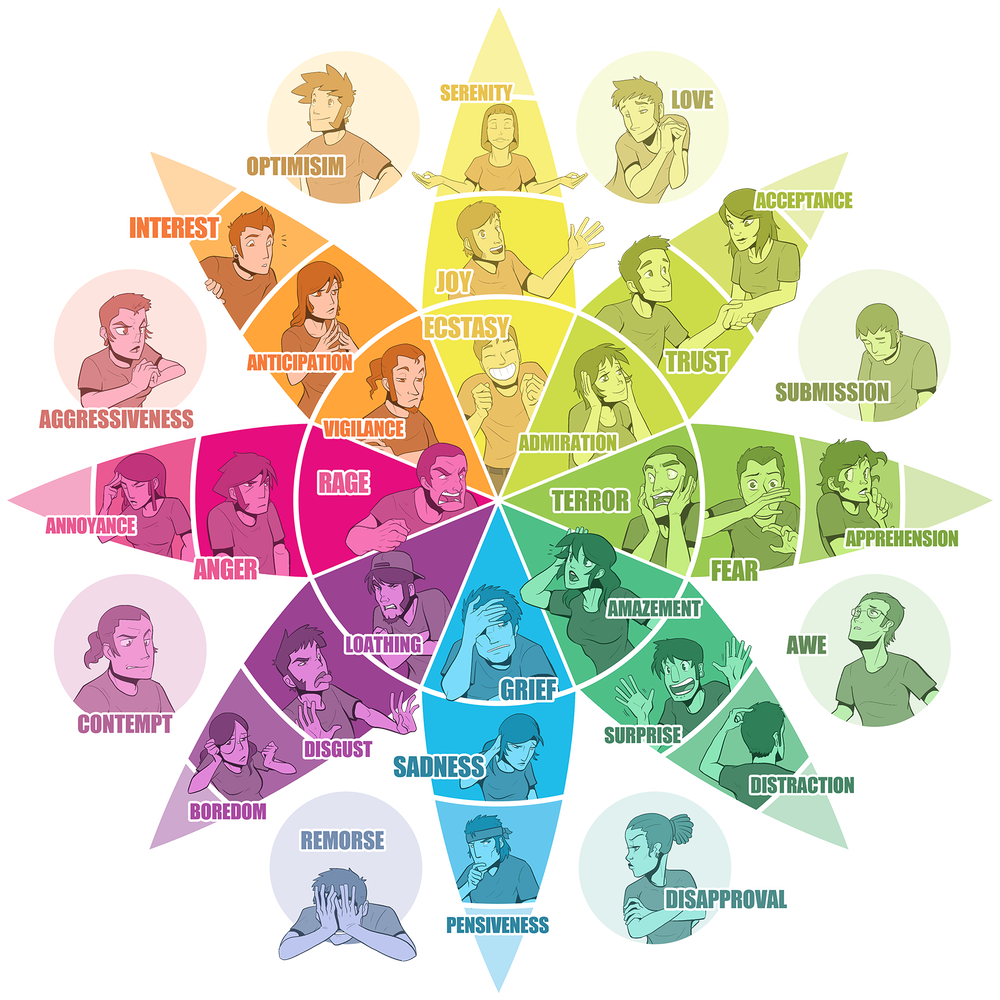

# Emotions Wheel
***by [BelR](https://github.com/belr20)***

---

## Heroku

* [emotions-wheel-by-belr20](https://emotions-wheel-by-belr20.herokuapp.com/)

## Resources

* [Text Classification with NLTK and Scikit-Learn](https://bbengfort.github.io/tutorials/2016/05/19/text-classification-nltk-sckit-learn.html)  
* [From Sentiment Analysis to Emotion Recognition: A NLP story](https://medium.com/neuronio/from-sentiment-analysis-to-emotion-recognition-a-nlp-story-bcc9d6ff61ae)  
* [Use Sentiment Analysis With Python to Classify Movie Reviews](https://realpython.com/sentiment-analysis-python/#how-classification-works)  
